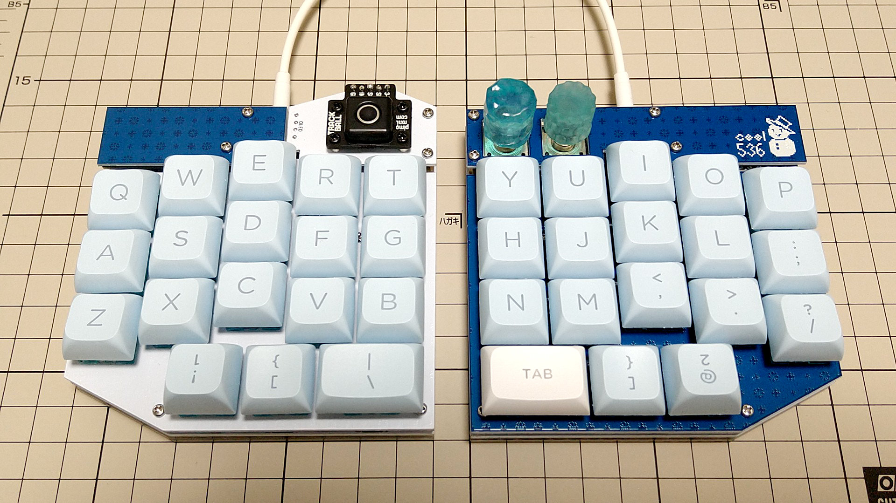

# cool536-plate

Original cool536: https://github.com/telzo2000/cool536

## Dependency
* [Salicylic-acid3/KiCAD_FootPrint](https://github.com/Salicylic-acid3/KiCAD_FootPrint)

## Notes
* We have only confirmed the installation in the environment of cool536 ver1.20 PCB + Cherry MX switches.
* The outline of the cover plate has been slightly modified because the keycaps were rubbing in my environment.