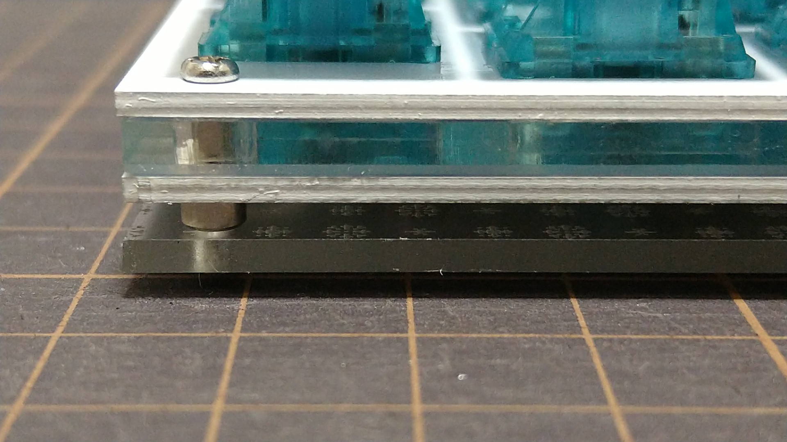

# cool536-plate_acrylic-plain

## Notes
* Thickness: 3mm
* When using FR4 top plate, it is recommended to put 0.5mm silicon sheet between the top plate and PCB because there will be a gap between the top plate and PCB.
